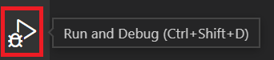
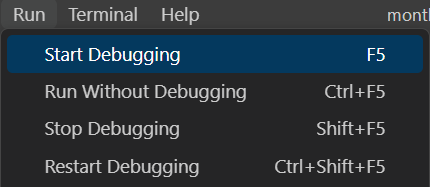

# Reading and Viewing Materials

## Exceptions and Exception Handling

## What is an Exception?

An exception is an event that occurs during the execution of a program that disrupts the normal flow of the program's instructions. An exception can be caused by various reasons, such as an invalid input data, hardware errors, network errors, or coding errors.

## What is Exception Handling?

Exception handling is the process of dealing with exceptions that occur during the execution of a program. When an exception occurs, the program stops executing its normal flow and transfer control to an exception handler that can handle the exception. The handler can then take appropriate actions to recover from the exception and continue executing the program. Exception handling typically involves the following steps:

- Detecting the Exception
The program detects an exception when an error occurs during the execution of a statement or block of code. An exception can also be detected by the software developer by writing code to detect a specific scenario.

- Handle the Exception

If a try block encloses the code which caused the raised exception the program executes the code in the except block to handle the exception. The exception can be handled in a variety of ways such as displaying a message to the user, retrying the operation or blacking out of changes.

- Resume Execution

After the exception is handled, the program resumes executing its normal flow.

## Try-except statement

When writing code that could potentially raise an exception, it is important to include code that is able to handle the exception.

Any exception that is raised (either by the software developer, or through normal execution of the program) must be handled. If an exception is not handled, the program will terminate prematurely and unexpectedly. Exception handling is achieved by using the try-except statement. The try block contains the code that may raise an exception, and the except block  contains the code that handles the exception. As with all other blocks discussed in Python, the try except statement uses indenting to identify the blocks.

In the example below, the user is prompted for a number. As a software developer, it is important to acknowledge that we have little control over the values provided externally (by users, files, databases, etc) Since the code that follows performs a division operation and the value provided by the user acts as the denominator we must plan for the possibility that the user will enter a 0.

In the example, the code in the try block is executed line-by-line. If any line of code raises an exception, program control transfers directly to the except block and all remaining code in the try block is skipped. The code in the except block handles the exception- in this case providing a message to the user.

Whether an exception was raised or not, program flow will then continue at the first line of code following the try-except statement.

```cs
try:
    #code that may raise an exception
    denominator = int(input("Enter a number value for a denominator"))

    quotient = 10 / denominator

    print(f"QUotient is {quotient}")

except ZeroDivisionError:
    # code to handle the exception
    print("Cannot divide by zero.")

print("Next line of code...")
```

Below is the output produced by the above code when the user enters a non-zero value for the denominator:

```cs
Enter a number: 10
Quotient is 1.0
Next line of code...
```

Below is the output produced gby the above code when the user enters a zero value for the denominator:

```cs
Enter  a numberic value for a denominator: 0 
Cannot divide by zero.
Next line of code...
```

```Finally block```
The finally block can be used to execute code that should occur regardless of whether the try code raised an exception.

Situations in which a finally block may be used include:

- Clean up Resources: The finally block is often used to clean up any resources that may have been accessed/used in the try block such as file or database resources. This ensures that the resources remain available ( not locked) following the try- except statement.

- Logging: (See logging below). Regardless of whether an exception occurred, you may want to write to the log file. Having logging code in the finally block will ensure an entry is written to a log file regardless of whether an exception occurred.
  
- Control Flow: The finally block may be used to help control the flow of logic. For example, logic could exist to determine determines whether to retry an operation, terminate the program, or take some other action based on the outcome of the try block.

In the code below, if the file called example.txt does not exist, an exception will occur when the open function executes, and control will transfer to the FileNotFoundError except block.

If the file does exist, the try block will continue until the line 10/0 executes which will raise an exception.

In either scenario, the finally block will execute, and if the file had been opened it will be closed.

```cs
 Note!
When the with clause is used to open a file, the file is automatically closed. In that case, the finally block would not be necessary.
```

```cs
#Initialize file to None (Null).
file = None

try:
    # Open the file in read mode.
    file = open("example.txt", "r")

    # Read the contents of the file.
    content = file.read()

    # Some exception that may occur unrelated to the input file.
    10 / 0 

    # Print the contents.
    print(content)

except FileNotFoundError:
    print("File not found.")

finally: 
    # Close the file in the finally block
    if file is not None:
    file.close()
    print("File closed.")
```

- Handle Multiple Exception types

You will be faced with situations where the sequence of statements you're attempted to do may potentially raise different types of exceptions. You may include more than one except block after a try block.

```cs
try:
    dividend = float(input("Enter a divident?: "))

    divisor = float(input("Enter the divisor number?: "))

    quotient = divident / divisor 

    print(f"{dividend} divided by {divisor} is {quotient}")

except ValueError:
    print("You must enter a numeric value.")

except ZeroDivisionError:
    print("The divisor cannot be zero.")
```

If you need to handle multiple exception types in the same manner, you can list exception types in the same except statement.

```cs
try:
    dividend = float(input("Enter the dividend?: "))

    divisor = float(input("Enter the divisor number?: "))

    quotient = dividend / divisor

    print(f"{dividend} divided by {divisor} is {quotient}")

except (ValueError, ZeroDivisionError):
    print("An error occurred.")
```

- Best Practices

As with all software development constructs, there are some best practices that should be followed when building exception handling into your solution:

- Be specific: Instead of using a bare except clause or using the Exception class to catch all exceptions, try to catch specific exceptions that you know how to handle. This will help you write more targeted and effective exception handling code.

- Location Matters: Ideally, you should handle exceptions as close as possible to where they occur. This will make it easier to understand what went wrong and why and it will also help prevent unexpected side effects.

- Error Messages: When you raise an exception, include an error message that provides enough information to diagnose and fix the problem. The message should be concise and informative, and it should not reveal any sensitive information.

- Use the **finally** Clause: Use the finally clause to ensure that resources are properly released and that cleanup is performed. 

- Don't Suppress Exceptions: Avoid suppressing exceptions or hiding them from the user. Instead, log the error (see logging below and provide a clear and actionable message to the user).

- Raising(or Throwing) an Exception: The program creates an exception object and throws it. The exception object contains information about the type of exception that occurred and the location where it occurred. If the exception is detected through code written to identify specific scenarios, the software developer must manually raise the exception.

## Raising an Exception

An exception can be raised implicitly by various built in functions or external libraries when they encounter errors or exceptional conditions. For example, an exception is raised implicitly when you attempt to read from a file that does not exist. There are number of specialized exception classes which are descendent of the **Exception** class.

Below are some of the most common specialized **exception** classes:

- ValueError: Raised when a function receives an argument of the correct type but with an invalid value.

- TypeError: Raised when a function receives an argument of the wrong type.

- NameError: Raised when a variable or function name is used that is not defined in the current scope.

- IndexError: Raised when an index into a sequence is out of bounds.

- KeyError: Raised when a key is not found in a dictionary.

- AttributeError: Raised when an attribute is accessed that does not exist.

- FileNotFoundError: Raised when a file cannot be found

- ZeroDivisionError: Raised when attempting to divide by zero.

- AssertionError: raised when an assertion fails (Assertions will be covered in an upcoming module).

An exception can also be raised by the software developer as a means to control the flow of a program whn certain conditions arise. The software developer can raise an exception using the **raise** keyword followed by an instance of an exception class. In the example below, the exception is raised with a message. The message may be useful to the software developer when the exception is handled, so using am meaningful message based on the condition that caused the exception is important.

```cs
raise TypeError("The input must be a numeric type.")
```

## Programming Challenge

Write a Python program that prompts the user to enter two numbers, and then computes the sum of those numbers. However, if the user enters a non-numeric value, your program should raise an exception. Ensure the raised exception is caught and display an error message.

Example output:

Enter the first number: 5
Enter the second number: 10.5
The sum is: 15.5

Enter the first number: 5
Enter the second number: abc
Error: Invalid input. Please enter a number.

## Review Questions

1. What is an exception and what can cause it to occur during the execution of a program?
Exception is an error that occurs during the execution of a program, this can occur for many reasons such as invalid operations **ZeroDivisionError**. Wrong data types such as **TypeError**. Missing Files such as ***FileNotFoundError**. Invalid values being inappropriate value to a function **IndexError**. Out of range access invalid index in a list **IndexError** and lastly Missing keys in a dictionary accessing a key doesn't exist **KeyError**

2. What is the role of an exception handler?
The role of an exception handler is to catch errors in a program and allow it to handle them without stopping unexpectedly.

3. What are the steps involved in exception handling?

    - try block that might raise an exception
    - except block handles the exception if one occurs
    - else block is optional executes if no exceptions occur in the try block
    - finally block is optional executes no matter what whether an exception occurred or not.

4. How can an exception be raised in Python?
Exceptions can be raised in Python when a statement is either correct or incorrect, depending on how the code is written. For example, if you try to open a file that doesn’t exist, a FileNotFoundError will be raised, indicating that the file cannot be opened. If the file is found, the program continues, but it may still raise other exceptions based on the next steps in the code.

5. What is the purpose of the try-except statement in Python?
The try-except statement is used to catch errors so the program doesn’t crash. It helps you handle problems like invalid input or missing files in a safe way.

## Logging

Logging is the process of keeping track of events that occur when a program is running. The event could be a problem, an error, or simply information about the current state of the program. A log entry is recorded for each occurrence of the event. Logs can be used to monitor the state of the  program, to assist in the debugging process, or to provide relevant information for purposes such as auditing.

Logging can help the software developer gain a better understanding of program flow as well as to learn about obscure scenarios that may not have been considered during the development process.

Logs can store information such as which user initiated a process or the time at which a failure occurred. These little clues can help a developer narrow down a problem or address performance issues etc. When an error occurs a carefully crafted log can provide more insight than what may be provided by an exception message or a stack trace.

## Types of Logs

There are a few types of log files that can be created through the logging process:

- **Event Logs**
An event log will provide a listing of events as they take place during the execution of a program

```cs
Timestamp               Event Description
------------------------------------------------------------
2023-04-05 09:30:15     User 'john.doe' logged in.
2023-04-05 09:30:20     User 'john.doe' initiated a bank data update.
2023-04-05 09:30:45     Bank data update completed.
2023-04-05 09:30:50     User 'john.doe' logged out.
```

- **Transaction Logs**
A transaction log records changes to database data. The primary purpose of a transaction log is to provide the detail necessary to recover a database from an unexpected failure as each transaction that may need restoring after some database failure had occurred.

```cs
Transaction ID  Timestamp                Transaction Description
----------------------------------------------------------------------------------------------
1001            2023-04-05 09:30:32     Bank data successfully retrieved.
1002            2023-04-05 09:30:35     Parsing bank data.
1003            2023-04-05 09:30:37     Validating bank data.
1004            2023-04-05 09:30:40     Bank data validation successful.
1005            2023-04-05 09:30:42     Updating bank data in database.
1006            2023-04-05 09:30:45     Bank data update completed.
```

- **Exception logs**
An exception log records exceptions as they occur during a program execution. Exception logs provide useful clues to the software developer during the debugging process.

```cs
Timestamp               Exception Type        Exception Description
----------------------------------------------------------------------------------------------
2023-04-05 09:30:25     APIConnectionError    Failed to connect to the external API.
2023-04-05 09:30:37     DataParsingError      Failed to parse bank data.
2023-04-05 09:30:42     DataValidationError   Invalid bank data format.
2023-04-05 09:30:45     DatabaseError         Failed to update bank data in the database.
```

## Logging Module

Python includes a logging module within its standard library. To use the logging module, it must be imported.

```cs
import logging
```

## Severity Levels

The logging Module by default includes 5 standard levels of severity. Those levels (in an increasing order of severity) are:
    - DEBUGGING
    - INFO
    - WARNING
    - ERROR
    - CRITICAL

Each level of severity includes a corresponding method which will write the logging message and assign the level of severity to that message:

```cs
import logging

logging.debug('Debug level message.')
logging.info('Info level message.')
logging.warning('Warning level message.')
logging.error('Error level message.')
logging.critical('Error level message.')
```

When the above code executes, the following output will appear. Note the following:
    - The word **root** is included in the message. **root** is the name the python logging module gives too its default logger. The output is presented by default as **{level: name: message}** format.

```cs
WARNING:root:Warning level message
ERROR:root:Error level message
CRITICAL:root:Critical level message
```

## Logging Configuration

Logging configuration can be set and modified using the **basicConfig()** method. Note: the naming of the **basicConfig()** method does not follow PEP8 standards as it uses camelCase instead of snake_case. This is because this module was adopted from a logging utility developed in the java programming language and as such has been named using Java standards. The **basicConfig()** method has been defined with **[**kwargs]** as its parameter. This indicates that all parameters supplied to this method must be done so as keywords arguments. The keyword arguments for the **basicConfig()** method that will be used in this course are:

- level: Defines the severity level at or above which messages will be logged.

- filename: When included, logging will be written to the specified file. If excluded, logging, by default, will be to the console. 

- filemode: If a filename was provided, filemode determines the way in which the file will be opened and processed. The default mode is a which indicates append -e.

- format: Defines the format of the logged message. The default format is {level: name: message}.

Below is an example of defining logging configuration for a program using the **basicConfig()** method of the logging module:

```cs
Note!
The logging module uses the %-style formatting syntax instead of f-strings. The logging module was introduced in python before the introduction of f-strings. Therefore, the %-style formatting syntax was the only option available for string formatting at the time.
```

```cs
import logging

logging.basicConfig(level=logging.DEBUG,
                   filename = 'app.log',
                   filemode = 'w',
                   format = %(asctime)s - %(levelname)s - %(message)s')

logging.warning('This will get logged to a file')
```

Based on the above code, the following would be written to a file called app.log:

```cs
2023-04-06 16:39:20,587 - WARNING - This will get logged to a file
```

## Logging Exceptions

In the types of log files listed above, an Exception log was included. When exceptions occur, the course of action may be to log the exception as part of the exception handling process. The logging module has an **exception** method which will log at the **ERROR** level of severity, and when used in an **except** block will also provide exception details.

```cs
import logging

numerator = 5
denominator = 10

try:
    quotient = numerator / denominator

except Exception:
    logging.exception("An exception has occured: ")
```

When logging using the **exception** message, exception details are included in the log as shown below:

```cs
2023-04-06 16:47:47,500 - ERROR - An exception has occurred:
Traceback (most recent call last):
    File "c:\Users\lauri\Desktop\Module 04\month_end_report.py", line 75, in <module>
    quotient = numerator / denominator
ZeroDivisionError: division by zero
```

```cs
Note!
The output below assumes the **BasicConfig** settings provided in the previous example.
```

## Logging in Classes

Classes is a topic that will be discussed in detail in an upcoming module. However, there may be a need to incoporate logging into a Class. In this section we will briefly discuss classes but only as they pertain to using logging.

Classes have a special method called __init__. This method is essentially used to initialize the class. the __init__ method is an excellent place to set up your logging configuration.

For logging to be able to be used throughout a class, along with the configuration, an extra line of code is needed in the __init__ method.

```cs
def __init(self):
    logging.basicConfig(level = logging.DEBUG,
                       filename = 'app.log',
                       filemode = 'w',
                       format = '%(asctime)s - %(levelname)s - %(message)s')

self.logger = logging.getLogger(__name__)
```

In the above code, the __init__ method is defined. Within the __init__, the logging configuration is also defined. Have a look at the following line of code:

```cs
self.logging = logging.getLogger(__name__)
```

This code defines a variable called self.logger. Since this variable is prefixed with self. it makes itself available throughout the class. So anytime you wish to log information in any method of your class, you would log as follows:

```cs
self.logger.debug("Debug level message ")
self.logger.info("Info level message ")
self.logger.warning("Warning level message ")
self.logger.error("Error level message ")
self.logger.critical("Critical level message ")
```

A much more comprehensive discussion on Classes will take place in an upcoming module.

## Programming Challenge

Write a Python program that will take inventory items and their quantities as input from the user. The program should prompt the user to enter an item name followed by its quantity. If the quantity value is numeric, write an INFO statement to the log file indicating the inventory item and its quantity. If the quantity is not numeric, an exception should be raised and an error message should be logged in the log file.
Assume all of the logging configuration has already been defined for you, you just need to use the logging module to log the error message in the log file.
The program should keep prompting the user to enter inventory items until the user types 'Q'.
Example output:

2022-05-02 12:25:05,246 - ERROR - Quantity for item 'Shoes' is not numeric: 'two'
2022-05-02 12:25:06,178 - INFO - Quantity for item 'Socks' is 10
2022-05-02 12:25:05,246 - ERROR - Quantity for item 'T-Shirts' is not numeric: 'XXII'
2022-05-02 12:25:06,178 - INFO - Quantity for item 'Hoodies' is 7
2022-05-02 12:25:06,178 - INFO - Quantity for item 'Pants' is 20

## Review Questions Logging

1. What is logging, and why is it useful in software development?

Logging is a process of recording information about a program's execution. This information can be normal operations, warnings error messages and debugging details.
Why is it useful in software development? This is useful because it helps developers find, and fix bugs by showing what the program was doing before and error occurred, it monitors system behavior in real time which can be useful to detect performance issues or failures, and this provides history records of activities, it is also easier to maintain and improve the software over time by how it behaves and lastly shows detail error messages report that are not visible to users.

2. What are the different types of logs that can be created through the logging process?

The different types of logs that can be created through are debug, info, warning, error and critical.

- Debug: is used for details, during debugging examples variables, values, functions entries and exits.

- Info: Confirms that things are working as expected, used for general system events or milestones such as user login successful, backup completed etc.

- Warning: Indicates a problem or unexpected events that stop the program examples would be monitored and low disk space.

- Error: Signifies a problem is preventing a part of the program from functioning properly, requires immediate action such as database connection failed.

- Critical: Severe error that causes the  whole program to stop running and used in emergency situations such as system crash or data loss.

3. What are the five standard levels of severity in the logging module, and how are they used?

- Debug (Level 10)
Purpose: Used for detailed information that is only good to diagnose a problem.

- Info (Level 20)
Purpose: Confirms that a a program is working as expected for general information use such as login successfully etc.

- Warning (Level 30)
Purpose: Used to indicate a problem or unexpected events that stop program.

- Critical (level 40)
Purpose: It is a severe error that causes the whole program to stop running and used in emergency such as database restore.


4. What is the basicConfig() method, and what are the keyword arguments used in it?
How can logging help in the debugging process?

The basic config method is part of python's logging module. It is used to configure basic settings for logging system such as output format, file destination, and severity level. Should only be called once at the beginning of the program.

- level
Sets the minimum severity level of messages to be logged (debug, info)

- filename
Specifies the file to write the logs to then logs are printed to console

- filemode
Sets the file mode 'w' to overwrite the file or 'a' to append default is 'a'

- format
Defines the format of the log messages (timestamp, level, message)

- datefmt
Sets the format date/time in logs if format includes a date/time

- style
Defines formatting style ('%', '{', or $} Default is '%')

## Debugging

A bug is anything that may cause a program to behave differently than expected. The bug can be a result of:

- Logic Error: Incorrect use of logic constructs can lead to unexpected results. Examples include, exiting a loop too early or having an incorrect outcome to an if/elif construct.

- Typographical Error(typo): Since python variables are dynamically typed, it is easy to mis-type the name of a variable in an assignment statement. Doing so will not update the intended variable, but instead will create a new variable which will lead to unexpected results.

Bugs regardless of their origin, can often be difficult to identify.

## Debugging Process

Debugging involves defining a set of steps to help effectively identify and solve the problem. Below is a list of commonly used steps:

- Identify the problem
- Reproduce the problem
- Determine the source of the problem
- Correct the problem through:
- A correction of the code
- A workaround
- Comprehensive Testing
- Documenting the problem and solution

## Debugging Best Practices

While some of the suggestions below take place prior to the debugging phase, all of the following support the debugging process:

- Follow coding standards: Before a problem or 'bug' even presents itself, you can set yourself up for debugging success by following coding standards. Having clearly defined variables, appropriate use of whitespace and up to date documentation can all aid to the debugging process.

- Avoid Hard-Coding: When coding avoid using hard coded values. Any time a hard-coded value is used, the code must be searched for all occurrences wheneveer that hard-coded value needs to be modified. Using a constant, or a variable for such values ensures that when changes need to be made, they only need to be made in a single location.

- Write Test Cases: In an upcoming module, you will learn about unit testing. Having good test cases means that when you make a modification to a program (either through debugging or through regular program maintenance) that modification can be validated by running through existing test cases.

- Implementing Logging: Logging can be utilized as a debugging strategy to help verify the accuracy of the code execution as well as to provide insight for application issues/performance.

- Programming Community: There is a whole community of coders out there who may have experienced a similar issue to the one in which you are debugging. There are sites such as Stack Overflow dedicated to support the tricky debugging problems that we often face.

- Remember what you've tried: Keep track of the things you have tried as you debug your code. This will help establish the scope of the problem. Additionally, once the problem has been resolved, the details of what was tried and what ultimately solved the problem, wil lbe a great reference for future similar errors.

## Debugging Utility/Debugger

A debugger is a software tool, often built directly into an Integrated Development Environment (IDE) (or provided as an extension) which allows for code to be paused and examined at run-time. Most debuggers also allow the software developer to execute the code line-by-line as well as stopping at defined points in the program. The software can modify the state of the program by manually setting variable values in an effort to simulate situations that are otherwise difficult to replicate.

## VS Code Debugger

The Python extension in Visual Studio IDE (Integrated Development Environment) supports debugging. Having a debugging utility built directly into the IDE allows the software developer to move seamlessly between debugging and developing without changing their work environment. While there are many features that can be explored within the VS Code Debugger, we will focus on those features most commonly employed:

- **BreakPoint**
A breakpoint allows an executing program to pause so that the software developer can examine the state of the program at a run time. When a breakpoint is encountered, the program pauses (but does not terminate).

To set a breakpoint, click beside a line of code in the editor margin. A red dot will appear beside the code.

To remove the breakpoint, click on the red dot to toggle it off.

Breakpoints can be seton any executable line of code. Breakpoints cannot be set on empty lines or lines containing comments.

```cs
# Update the appropriate variables 
> if transaction_type = 'D':
    total_deposits += float(amount)
```

```cs
**Using Debug Mode**
To run the application in debug mode, you either click on the Run and Debug icon on the Activity Bar. Once running the Run and DEbug Icon changes to indicate that the program is currently running in Debug mode:


```

```cs
or you can click the run menu option and choose start debugging:

```

```cs
**Debug Floating Toolbar**
Once in Debug mode, the debug toolbar will float above the code editor pane:

```

```cs
**Continue/Pause**


When a breakpoint is encountered the program pauses so that the software developer can examine the state of the running program (variable values, call stack , etc). To resume running the program until the next breakpoint is encountered, click the Continue/Pause button.
```

```cs
**Step-Through Options**
Once a breakpoint is encountered in an executing program the software developer can control the pace at which the remaining lines of code execute through a few step options:


The step over option will execute the next line of code, but if that next line of code is a call to a user-defined function or user-defined method, the debugger will not enter th efunction or method code, but will just continue on the next line of code.
```

### Step Into

The step into option will execute the next line of code. If the next line of code is a call to a user-defined function or user-defined method, the debugger will step into that function or method, and allow the developer to execute the function or method code line by line.

Step Out
Step Out

If the debugging process has led the software developer into a user-defined function or user-defined method, the Step Out option will allow the developer to exit that function or method and return to the calling code. In this case, the code is still executed, but the software developer can bypass examining that code line-by-line.

Restart
Restart

The Restart button on the floating toolbar will restart the debugging session.

Stop
Stop

The Stop button on the floating toolbar will stop the debugging session.

Current Line
When in Debug Mode, the line of code that is next to be executed will appear highlighted and a yellow hollow arrow will appear in the editor margin. In the example below, line 21 will be the next line of code to execute.

Current Line

Watch Window
When debugging, values of certain variables may be of interest to the software developer. The Watch Window can be used to display these variables. As the code is executing, the watch window variable values will be updated. This can be valuable to help the developer ensure that updates to values are accurate and are taking place when expected. To add variables to the Watch Window, right click on the variable and select 'Add to Watch'.

Watch Window

Call Stack
The call stack provides a history of the function calls that has led to the current location in the code. This is helpful in the debugging process as it helps to confirm that functions are being executed in the expected order based on the conditions provided.

Call Stack

Debug Console
The Debug Console can be used to interact with your code while debugging. For example, when you encounter a breakpoint, you can type the name of a variable into the Debug Console and it will display that variable's current value. In the example below, transaction_type was entered into the console beside the '>' prompt. The current value of transaction_type is then displayed.

Debug Console

Review Questions
What is a bug in programming, and what are the two types of bugs mentioned above?
What are the steps involved in the debugging process as outlined in the notes?
What are some best practices for debugging?
What is a breakpoint?
What are the step-through options available in the VS Code Debugger?